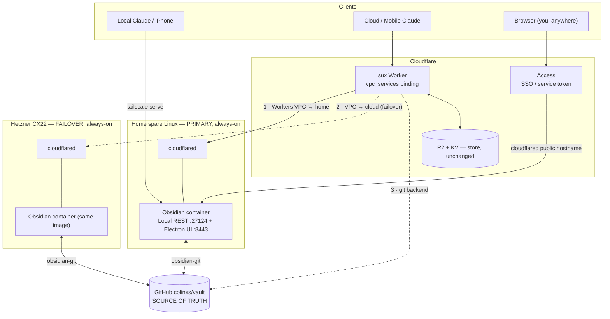
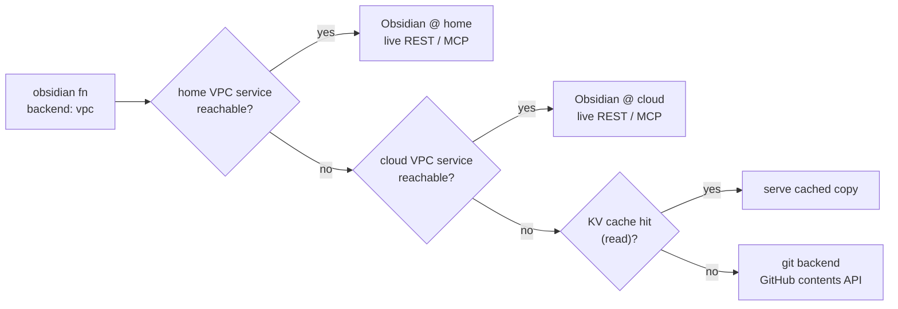

# Self-hosting the vault: home + cloud, over Cloudflare Workers VPC

Companion to [domains.md](domains.md) and [architecture.md](architecture.md). Answers the three "figure out" questions: (1) self-host the vault at home on a spare Linux box, (2) an always-on cloud host with an Electron web app, (3) how Cloudflare Zero Trust (`cloudflared`) maps onto Tailscale (`tailscaled`). Research-verified 2026-07-08; Colin's decisions locked inline.

## The problem this actually solves

Half the store code written this session is degrade logic for **"the Mac is asleep"** — the KV read-through cache, the remote→git fallback, the 5xx fallback. That whole problem class exists because the live vault lives on a **laptop**. Move it onto an **always-on box** and the live surface is just… always there; the fallbacks become rare-event insurance, not the common path. Second win: today the Local REST API is on a **public** Tailscale Funnel (`:8443`) where the bearer key is the only lock, and **all three** Funnel public ports (443/8443/10000) are consumed. Cloudflare Workers VPC removes both problems at once.

**Decisions (Colin, 2026-07-08):** primary = **home spare Linux box**, cloud = **failover**; Worker→vault transport = **Workers VPC (cloudflared), retire the public Funnel**.

---

## 1. Transport: Cloudflare Workers VPC

[Workers VPC](https://developers.cloudflare.com/workers-vpc/) (beta, **free** during beta) lets the sux Worker reach a **private** HTTP service over a `cloudflared` tunnel — no public hostname, no Funnel. It is the native answer to the question that forced the current public-Funnel design: *how does an off-tailnet Worker reach a private vault?*

- **`cloudflared`** runs on the vault box (outbound-only, zero inbound ports) and can reach `127.0.0.1:27124` (the Local REST API).
- Register that endpoint as a **VPC Service** → get a `service_id`.
- Bind it in the Worker and call it like `fetch`:

```jsonc
// wrangler.jsonc
"vpc_services": [
  { "binding": "OBSIDIAN_HOME",  "service_id": "<home-service-id>",  "remote": true },
  { "binding": "OBSIDIAN_CLOUD", "service_id": "<cloud-service-id>", "remote": true }
]
```
```bash
# on each box, after its cloudflared tunnel is up:
npx wrangler vpc service create obsidian-vault-home \
  --type http --tunnel-id <TUNNEL_ID> --hostname localhost \
  --https-port 27124 --cert-verification-mode disabled
```
```ts
// in the fn: same surface, private transport
const r = await env.OBSIDIAN_HOME.fetch("https://vault/vault/Inbox/x.md", {
  headers: { Authorization: `Bearer ${env.OBSIDIAN_REMOTE_KEY}` },
});
```

Why this is strictly better than the Funnel:

| Property | Public Funnel (today) | Workers VPC |
|---|---|---|
| Public hostname for the vault API | **yes** (bearer key = only lock) | **none** — private |
| SSRF protection | manual (the fn's guards) | **built-in** — routing is pinned to the registered host:port; the URL host only sets `Host`/SNI |
| Port ceiling | 3 total, all used | none (native binding) |
| Transport to the Worker | external `fetch` to a `ts.net` URL | `env.BINDING.fetch()` |
| Cost | free | free (beta) |

Two facts to honor: Workers VPC handles **network reachability only** — the Obsidian **bearer key still rides** as `Authorization: Bearer` (now over a private channel, never in a public URL). And the plugin's HTTP `:27123` is off by default; only HTTPS `:27124` (self-signed) is on — so target `--https-port 27124 --cert-verification-mode disabled` (or explicitly enable `:27123` in the plugin). Creating a VPC Service needs the **Connectivity Directory Admin** account role.

**Code change (one build item):** the `obsidian` fn gains a **`vpc` backend** — a peer of `remote` that calls `env.OBSIDIAN_HOME.fetch(...)` (then `OBSIDIAN_CLOUD`) instead of `fetch(OBSIDIAN_REMOTE_URL...)`. Same `/vault/`, `/search/`, `/mcp/` handling, same bearer header, same KV cache — only the transport swaps. Then `OBSIDIAN_REMOTE_URL` retires and the `:8443` Funnel is freed.

---

## 2. `cloudflared` ↔ `tailscaled` — the mapping

The one-liner: **`cloudflared` is to Cloudflare what `tailscaled` is to Tailscale** — the outbound daemon on the origin box that joins the fabric. The decisive row is the one that made the current design settle for public Funnels.

| What you want | Tailscale | Cloudflare |
|---|---|---|
| Origin daemon on the box | `tailscaled` (WireGuard mesh peer) | `cloudflared` (outbound tunnel connector) |
| **Off-fabric Worker → private service** | **impossible** — Worker is off-tailnet, must use a public Funnel | **Workers VPC** (`vpc_services` / `vpc_networks`) — private, native |
| Expose a service publicly | `tailscale funnel` — **3 ports** (443/8443/10000) | Tunnel public hostname (`vault.example.com`) — **unlimited hostnames** |
| Expose to your own devices only | `tailscale serve` (tailnet-only, injects identity) | Tunnel + **Access self-hosted app** (SSO/WARP-gated) |
| A device joins the private network | tailnet node (100.x IP, MagicDNS) | **WARP** client + device enrollment |
| Machine-to-machine auth | tailnet ACLs / node keys | Access **service tokens** (`CF-Access-Client-Id` / `-Secret`) |
| Injected identity header | `Tailscale-User-Login` | `Cf-Access-Authenticated-User-Email` / JWT |
| SSH | Tailscale SSH | Access for Infrastructure / browser SSH |
| Self-hosted control plane | **Headscale** | (managed only) |
| Relay / edge | DERP | Cloudflare edge / Argo |
| DNS | MagicDNS | Gateway / `cloudflared` resolver |
| Embed a node in an app | `tsnet` (Go) | (no equivalent — `cloudflared` is a sidecar) |

Verified nuances that matter here:

- **A Worker *can* auth to an Access-protected origin** with a service token (`CF-Access-Client-Id`/`-Secret` headers + a *Service Auth* policy). This is the public-hostname alternative to Workers VPC — useful for the human web UI, below.
- **No loopback trap:** the only same-zone `fetch` restriction is Worker→Worker on a route. A Worker→tunnel-hostname call is a normal origin subrequest and works on the same account — *just don't bind the vault hostname as one of the sux Worker's own routes.*
- **WARP is device-only.** It's the true tailnet analogue (your laptop reaching the box's private CIDR), but a Worker can't run WARP — so the Worker path *must* be Workers VPC (or public-hostname + Access token). WARP only helps *your* devices.
- **Both daemons coexist** on one box. The design runs `cloudflared` (for the Worker) and keeps `tailscale serve` (for your own devices / local Claude) side by side.

**Net:** `cloudflared` + Workers VPC for the Worker→vault data path; `tailscale serve` stays for your devices; the **public Funnel retires**. The mcp-gate's tailnet-identity tier survives; only its public secret-path tier becomes redundant.

---

## 3. The host recipe (home box and cloud, identical)

Both boxes run the **same** container. The sux `remote`/`vpc` backend's surface (`/vault/`, `/search/`, `/mcp/`) **is literally** the coddingtonbear "Local REST API (with MCP)" plugin — so any host running that plugin inside Obsidian keeps the Worker working with zero rewrite.

- **Image (with the Electron web-app "bonus"):** `linuxserver/obsidian` or `sytone/obsidian-remote` — the real Obsidian Electron app under **KasmVNC**, browser UI on `:8080`/`:8443`. Install **Local REST API** + **obsidian-git** through the browser once (they persist in `/config`). amd64 on ghcr.io; ARM64 via the Docker Hub `:arm64` tag (so a home Pi and an amd64 cloud box both work). Footprint ~300–500 MB RAM, ~2 GB image.
- **Make the REST API reachable:** set the plugin's **Binding Host** to `0.0.0.0` and publish `:27124` (the config lives in `.obsidian/plugins/obsidian-local-rest-api/data.json`; API key enforced in that mode). `cloudflared` then targets it.
- **Vault = a git checkout** of `colinxs/vault`, bind-mounted in. **obsidian-git** does two-way sync (short interval — an uncommitted Obsidian write is the *one* thing GitHub can't recover). The disk is a disposable cache of git-truth; wipe it and it re-clones.
- **Headless alternative (cloud, no VNC):** `shanehull/obsidian-remote` runs Obsidian headless (Xvfb) with a bundled Go MCP server on `:4000` — leaner, actively maintained. It fronts `/mcp` not the raw REST paths, so publish its internal `:27124` if you want the sux REST surface too. (`obsidian-headless`, the official CLI, is **sync-only** — no REST — so it doesn't replace the plugin.)

Dropping Electron entirely (a non-Obsidian markdown MCP/REST server) is possible but **none** of those reimplement the `/vault/`+`/search/`+`/mcp/` contract — you'd retarget the Worker to its **git backend** (already built) or to a different MCP. Keeping the plugin is the zero-rewrite path.

---

## 4. Target topology



The Worker's preference order (the failover ladder — an extension of the KV/git degrade already in the code):



Editable Excalidraw of the topology: [`diagrams/vpc-topology.excalidraw`](diagrams/vpc-topology.excalidraw).

---

## 5. Cloud vendor & what moves vs stays

**Primary cloud target: Hetzner CX22** (~$4.59/mo — 2 vCPU / 4 GB / 40 GB persistent NVMe, full root) — cheapest always-on option with real disk. Run the same KasmVNC container + the obsidian-git loop; expose via `cloudflared` (Workers VPC). Alternative if you'd rather not run a tunnel daemon: **Fly.io** (~$5–14/mo + $0.15/GB volume) gives an automatic `*.fly.dev` HTTPS hostname, so the Worker could reach it over a public URL with an Access service token instead of VPC. **Not Cloudflare Containers** — GA (Apr 2026) but disk is **ephemeral** (fresh on every restart), so a filesystem vault wouldn't survive; wrong tool unless you externalize all state.

**What moves:** only the *live REST/MCP host* — off the sleeping Mac, onto the home box (+ cloud). **What stays put:** `colinxs/vault` on GitHub is still the source of truth; **R2 + KV are Worker-bound and don't move**; the Dropbox app folder stays the human blob exchange. The store question answers itself — nothing about the store relocates.

---

## 6. Build order

0. **Home box first.** Spare Linux → KasmVNC Obsidian container → install Local REST API + obsidian-git → point at a `colinxs/vault` checkout → confirm the Electron UI in a browser and the REST API on `:27124`.
1. **`cloudflared` on the home box** → named tunnel → `wrangler vpc service create obsidian-vault-home` → note the `service_id`.
2. **`vpc` backend on the `obsidian` fn** — `env.OBSIDIAN_HOME.fetch(...)`, then cache/git fallback as today; add `OBSIDIAN_CLOUD` to the ladder. Wire the `vpc_services` bindings. Deploy.
3. **Cut over + retire the Funnel** — point the Worker at `backend:vpc`, verify, then `tailscale funnel --https=8443 off` and drop `OBSIDIAN_REMOTE_URL`.
4. **Human web UI** — a `cloudflared` public hostname for the KasmVNC UI behind **Cloudflare Access** (SSO), so you reach the full Obsidian app from any browser.
5. **Cloud failover** — Hetzner CX22, same container, second tunnel + `obsidian-vault-cloud` VPC Service, added to the ladder.

## 7. Open items

- **Service-token rotation** (if you use the public-hostname + Access path for the web UI): tokens expire (~1 yr), a lapse silently breaks the caller — set the 1-week-out alert. Workers VPC bindings don't have this (no token).
- **obsidian-git conflict safety** at short intervals across two live nodes (home + cloud) both auto-committing — pick one as the write master, or lengthen the cloud node's push interval, to avoid merge churn. (Realistically only the home node takes interactive writes.)
- **Access for MCP / Managed OAuth** (shipped 2025) is the future upgrade if you want AI-agent OAuth to the vault MCP instead of a static bearer — deferred; the bearer + Workers VPC is enough now.
- Vault out of iCloud on the Mac becomes moot once the live vault is the Linux box (the [iCloud-materialize gotcha](knowledge-store-live.md) disappears).
